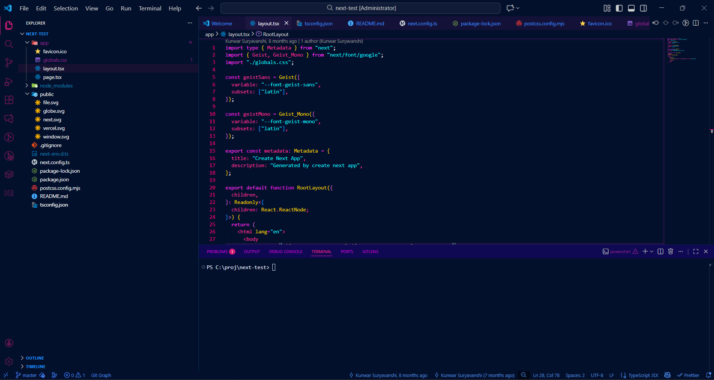
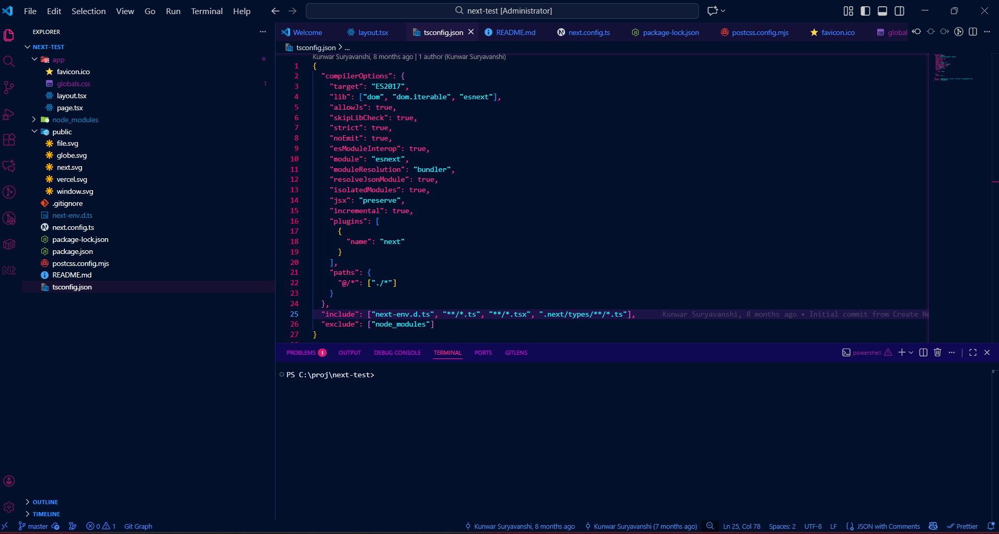

# KvS-2077 Cyberpunk Theme

A stunning cyberpunk-inspired dark theme for Visual Studio Code, drawing inspiration from the neon-soaked aesthetic of futuristic dystopian worlds. Perfect for developers who want to immerse themselves in a high-tech, visually striking coding environment.

## Features

- **Dark Theme Design**: Optimized for low-light environments with carefully selected color palettes
- **Cyberpunk Aesthetic**: Neon-influenced color scheme that brings a futuristic vibe to your editor
- **Comprehensive Syntax Highlighting**: Support for multiple programming languages with distinct token colors
- **UI Customization**: Carefully crafted colors for all VS Code interface elements
- **Terminal Colors**: Custom ANSI color palette that matches the overall theme aesthetic
- **Eye-Friendly**: Designed to reduce eye strain during extended coding sessions

## Screenshots




## Installation

### Via Visual Studio Code Marketplace

1. Open Visual Studio Code
2. Go to Extensions (Ctrl+Shift+X / Cmd+Shift+X)
3. Search for "kvs-2077"
4. Click Install
5. Select the theme from Preferences > Color Theme > KvS-2077

### Manual Installation

1. Clone or download this repository
2. Copy the folder to your VS Code extensions directory:
   - **Windows**: `%USERPROFILE%\.vscode\extensions\`
   - **macOS**: `~/.vscode/extensions/`
   - **Linux**: `~/.vscode/extensions/`
3. Restart Visual Studio Code
4. Select the theme from Preferences > Color Theme > KvS-2077

## Usage

Once installed, activate the theme by:

1. Opening the Command Palette (Ctrl+Shift+P / Cmd+Shift+P)
2. Typing "Color Theme"
3. Selecting "KvS-2077" from the list

Or navigate to:
- **Settings** > **Appearance** > **Color Theme** > **KvS-2077**

## Theme Details

### Color Palette

The KvS-2077 theme features a carefully curated color palette optimized for code readability:

- **Primary Background**: Dark cyberpunk base with subtle variations
- **Text Foreground**: High-contrast bright colors for optimal readability
- **Syntax Elements**: Distinct colors for:
  - Keywords and operators
  - Strings and escape sequences
  - Comments and documentation
  - Functions and class definitions
  - Variables and constants
  - Numbers and booleans
  - Markup and tags

### UI Elements

The theme provides custom styling for:

- **Editor**: Background, foreground, cursor, selections, and line highlights
- **Status Bar**: Theme-aware status bar with context-sensitive backgrounds
- **Sidebar**: File explorer and other sidebar panels
- **Tabs**: Active and inactive tab styling
- **Terminal**: Full ANSI color support for integrated terminal
- **Buttons & Input**: Hover effects and interactive element styling
- **Notifications & Alerts**: Error, warning, and info message colors

## Supported Languages

The theme includes optimized syntax highlighting for:

- JavaScript & TypeScript
- Python
- Java
- C/C++
- C#
- Go
- Rust
- PHP
- Ruby
- HTML & CSS
- JSON
- XML & Markup
- Shell scripts
- And many more...

## Customization

If you want to customize the theme further, you can:

1. Open the theme file: `themes/KvS-2077-color-theme.json`
2. Modify color values to suit your preferences
3. Reload the window (Ctrl+R / Cmd+R) to see changes

### Popular Customizations

- **Increase Brightness**: Modify the hex color values to lighter shades
- **Change Accent Colors**: Update specific token colors in the `tokenColors` array
- **Adjust UI Colors**: Modify the `colors` section for interface customization

## Requirements

- Visual Studio Code version 1.101.0 or higher
- A display that supports 24-bit true color (recommended for full effect)

## File Structure

```
2077-theme/
├── themes/
│   └── KvS-2077-color-theme.json    # Main theme configuration
├── .vscode/
│   └── launch.json                   # VS Code configuration
├── README.md                          # Original README
├── CHANGELOG.md                       # Version history
├── package.json                       # Extension metadata
├── .gitignore                         # Git ignore rules
├── .gitattributes                     # Git attributes
└── .vscodeignore                      # Files to exclude from package

```

## Performance

The KvS-2077 theme is lightweight and optimized for performance:

- Minimal JSON file size
- No external dependencies
- Fast theme loading
- No impact on editor performance

## Browser Compatibility

This theme is designed exclusively for Visual Studio Code and is not compatible with other editors or online code editors. For web-based code editors, you may find similar cyberpunk themes available.

## Contributing

Found an issue or have suggestions? Feel free to:

1. Report issues on the repository
2. Suggest improvements or new features
3. Share your feedback and customization tips

## License

This theme is provided as-is for use with Visual Studio Code. Please refer to the repository for licensing details.

## Changelog

See `CHANGELOG.md` for a detailed list of changes and version history.

## Support

For issues, questions, or feature requests:

1. Check the existing issues first
2. Provide details about your setup (OS, VS Code version, etc.)
3. Include screenshots if possible

## Tips & Tricks

- **Adjust Font Size**: Pair with your favorite monospace font for optimal appearance
- **Use with Extensions**: Works great with popular VS Code extensions
- **Terminal Integration**: Enable the integrated terminal to enjoy the full cyberpunk experience
- **Keyboard Shortcuts**: Customize keybindings to match your workflow

## Related Resources

- [VS Code Theme Documentation](https://code.visualstudio.com/docs/getstarted/themes)
- [VS Code Color Reference](https://code.visualstudio.com/docs/getstarted/theme-color-reference)
- [VS Code Extension API](https://code.visualstudio.com/api)

## Enjoy!

Immerse yourself in the cyberpunk aesthetic and enhance your coding experience with the KvS-2077 theme. Happy coding! 🚀

---

**KvS-2077 Theme** - Where code meets neon.